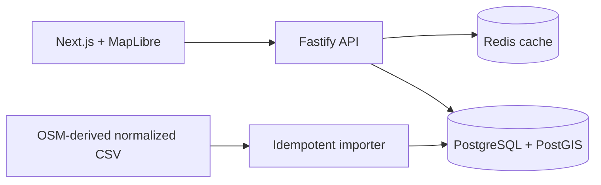

# Atlas — Location Search & Discovery

A production-minded location discovery vertical slice: Fastify + PostGIS candidate
retrieval, explicit relevance scoring, stable cursor pagination, Redis acceleration,
Prometheus metrics, and a deliberately thin Next.js/MapLibre interface.



## Run locally

Requirements: Docker Compose and Node 22/Corepack.

```bash
cp .env.example .env
corepack enable
pnpm install
docker compose up -d postgres redis
pnpm import:data -- --file data/sample-places.csv
pnpm dev
```

Open `http://localhost:3000`; API documentation is at `http://localhost:4000/docs`
and Prometheus metrics at `/metrics`. Alternatively, `docker compose up --build`
starts the entire stack.

```bash
curl 'http://localhost:4000/api/v1/places/search?q=coffee&lat=33.7701&lon=-118.1937&radius_m=5000'
curl 'http://localhost:4000/api/v1/places/nearby?lat=33.7701&lon=-118.1937&radius_m=1000'
curl 'http://localhost:4000/api/v1/places/bbox?west=-118.21&south=33.75&east=-118.17&north=33.79'
```

## Dataset contract

The checked-in four-row fixture proves the path without pretending to be a benchmark.
For a real run, export OpenStreetMap POIs into the documented normalized CSV columns,
then run the same importer. Large data is intentionally ignored by Git. The importer
upserts `(source, source_id)`, rejects invalid coordinates, and records every run in
`import_batches`.

## Engineering highlights

- `ST_DWithin(geography, geography, meters)` prunes candidates using the GiST index;
  exact `ST_Distance` is computed only for candidates.
- Prefix/trigram text relevance, proximity, popularity, and category components are
  normalized and visible in development using `explain=true`.
- The cursor carries score, distance, and UUID tie-breaker; it is opaque to clients.
- Redis failures emit metrics/logs and fall through to PostgreSQL.
- Radius, result size, body rate, coordinate pairing, and bounding-box area are bounded.

## Verification

```bash
pnpm lint && pnpm typecheck && pnpm test && pnpm build
docker compose up -d postgres redis
pnpm test:integration       # integration suite when Docker is available
k6 run load-tests/mixed.js  # after importing a representative dataset
```

No benchmark result or screenshot is committed yet: these must be captured from an
actual representative (target 100K+) import. See [performance runbook](docs/database-indexes.md).

## Intentional limits

This MVP is a modular monolith, not a geocoder, route planner, social product, or
premature microservice/Kubernetes deployment. Search-engine adoption is a measured
future option, not résumé decoration. See [scaling](docs/scaling.md) and
[decisions](docs/decisions.md).
